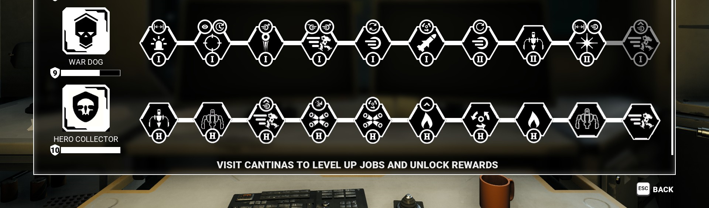

  

  
  
  

> **"The original was gone. The design was good. Bringing it back."**

Community-maintained fork of **Kurst's [ZuluBetterHeroes](https://www.nexusmods.com/mechwarrior5mercenaries/mods/535/)** mod for MechWarrior 5: Mercenaries. The original was removed from the Steam Workshop after DLC 7 broke the cantina-upgrade integration and the author lacked the modding skill to fix it. This fork updates the mod to work with the current MW5 version **while preserving the original design and behavior** — including intentional decisions Kurst documented.

  

## ✨ What it does

Adds a **Hero Collector Trait Tree** to your cantina, unlocked by completing one **Mech Collector** mission.

### Passive Hero Traits
*0 points · 1-day refit · 10,000 CBill · Hero Mechs (intended — see limitations)*

| Trait | Effect |
|---|---|
| Heroic Structure | +20% structure |
| Heroic Armor | +10% armor |
| Heroic Speed | +10% top speed |
| Heroic Damage | +5% damage |
| Heroic Weapon Speed | +5% weapon cooldown |
| Heroic Heat Capacity | +5% heat capacity |
| Heroic Cooling | +5% cooling |
| Heroic Heat Gen | -5% heat generation |

### Active Traits
*1 point · 10-day refit · 500,000 CBill · ANY mech*

| Trait | Effect |
|---|---|
| Reinforced Arms | +20% armor to arms |
| Reinforced Legs | +20% armor to legs |

## ⚠️ Known limitations (inherited from the original)

- **Passive traits aren't blueprint-restricted to hero mechs at the engine level.** Any mech can equip the "hero-only" passive traits. This is intentional — Kurst's original description said: *"I apologize but I lack the skill to make blueprints so that the hero traits can only be equipped by hero mechs."* Reforged preserves this as-is out of respect for the original author's choice and to keep behavior 1:1 with the original.

## 🚀 Install

1. **Subscribe via Steam Workshop** *(once the reforged version is published — link coming soon)*, **or**
2. **Manually** copy this mod folder to `%LOCALAPPDATA%\MW5Mercs\Saved\Mods\ZuluBetterHeroes-Reforged\`
3. Enable the mod in the in-game **Mod Manager** and restart MW5
4. Complete a Mech Collector mission to unlock the Hero Collector Trait Tree in your cantina

## 🎯 Compatibility

- ✅ **MechWarrior 5: Mercenaries** — current version (post-DLC 7)
- ✅ **Existing save games** — safe to add
- ⚠️ **Other cantina-upgrade mods** — may conflict if they touch the same upgrade nodes

## 🐛 Found a bug?

- **[Open an issue with the bug template](https://github.com/gitpush-mod/mw5-zulibetterheroes-reforged/issues/new?template=bug_report.md&labels=bug)**

## 🙌 Credits

- **Original concept, design, and implementation** — **Kurst** ❤️
- **Original Steam Workshop release** — [2605057304](https://steamcommunity.com/sharedfiles/filedetails/?id=2605057304) *(removed)*
- **Original Nexus Mods mirror** — [Mod #535](https://www.nexusmods.com/mechwarrior5mercenaries/mods/535/)
- **Reforged port** — [Chris Carpenter (Godimas101)](https://github.com/Godimas101)

## 📜 License

Inherits the original mod's license terms (Steam Workshop default). This fork is distributed for free under the same conditions.

## 🧡 Support

Free and always will be. **Patreon** for the ongoing project log.

---

*Part of the [`gitpush-mod`](https://github.com/gitpush-mod) mod collection. Made with ♥ (and a lot of coffee) by Godimas + Claude.*
